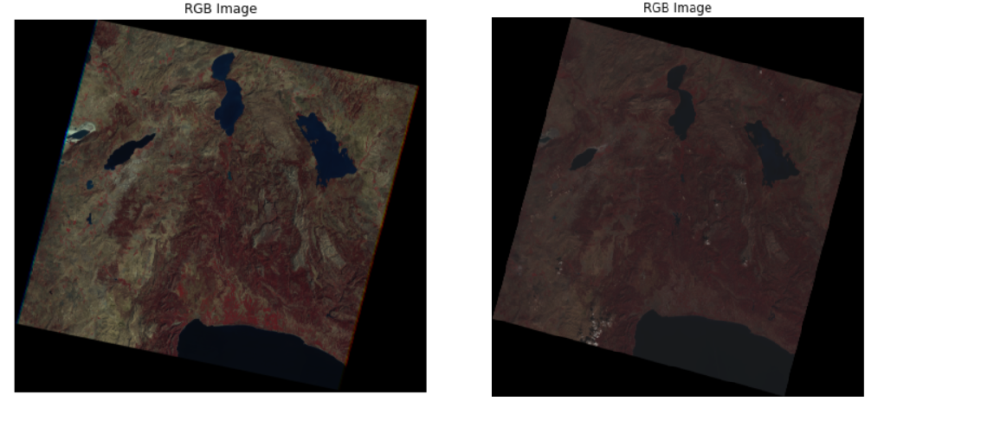
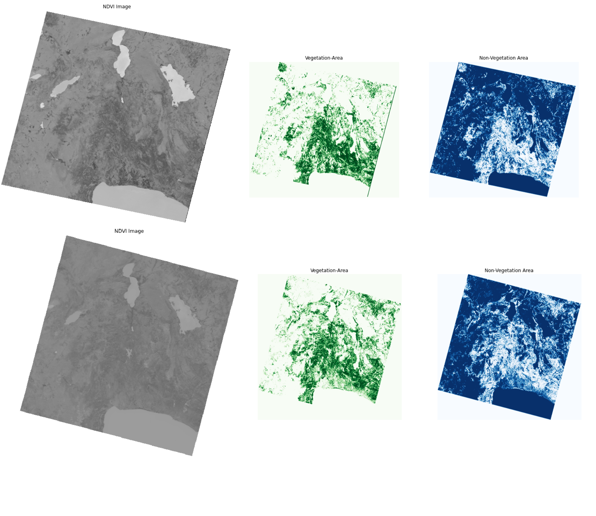
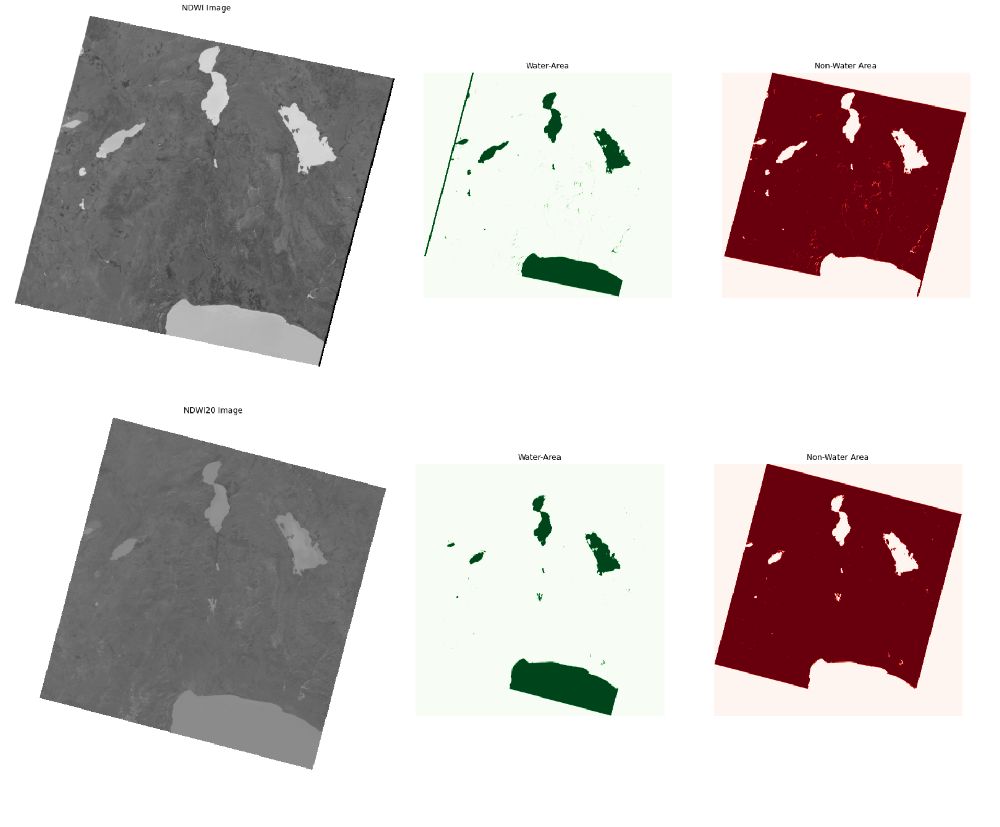

# NDVI-NDWI Calculations
The test images which are used for this project are downloaded from https://earthexplorer.usgs.gov/
To see the vegetaiton and lake cover near Burdur area in Turkey, NDVI and NDWI calculations are applied with the given codes. 1985 and 2020 are selected as study years and september, october and november are selected as study months for each year. 
Since Landsat5 data starts in 1984 and ends in 2012, it is selected as the sensor for 1985 study area. On the other hand Landsat8 data starts in 2013 and comes today, it is selected as the sensor for 2020 study area. 

## Libraries Used in Jupyter Notebook
- matplotlib
- numpy
- skimage

## Data Collection and Band Selection
- For the year 1985, input bands are downloaded from the given usgs link above. The metadata of the test image is:
https://earthexplorer.usgs.gov/scene/metadata/full/5e83d0a05ee25348/LT51780341985264FUI00/

- For the year 2020, input bands are downloaded from the same page again and the metadata is:
https://earthexplorer.usgs.gov/scene/metadata/full/5e81f14f59432a27/LC81780342020281LGN00/

RGB color images are given above as the left one is 1985 and the right one is 2020 image.
 

Since the NDVI and NDWI calculations are done with Green, Red and NIR bands,
- Band1, band2, band3, band4 (blue, green, red, NIR) extracted from Landsat5 imagery
- Band2, band3, band4, band5 (blue, green, red, NIR) extracted from Landsat8 imagery

## NDVI Calculations
In Normalized Difference Vegetation Index NIR band and Red band are used where vegetation reflectance has its maximum values. The formula of NDVI calculation is;
- (NIR-Red)/(NIR+Red)

In the given images, upper one show the NDVI output of the 198 image and lower one shows 2020.

In the color images, Vegetaion-Area images show the areas vegetated with green color while Non-Vegetation Area images show the non-vegetated areas with blue.
It can be easily seen that there is a decrease in vegetation cover from 1985 to 2020 by looking at the left upper corners of the images.

## NDWI Calculations
In Normalized Difference Water Index, NIR band and Green band are used for the detection of the water bodies' water content. The formula of NDWI calculation is;
- (Green-NIR)/(Green+NIR)

In the given images, upper one show the NDWI output of the 198 image and lower one shows 2020.

It can be seen that the water content is decreased 2020 by looking especially at Burdur Lake which lies on the left on the image. It can be said that its upper sides of the Burdur Lake have dried up over the years.

## References
- https://datacarpentry.org/image-processing/03-skimage-images/
- https://en.wikipedia.org/wiki/Normalized_difference_water_index
- https://github.com/iremkapucuoglu/Incices.git
